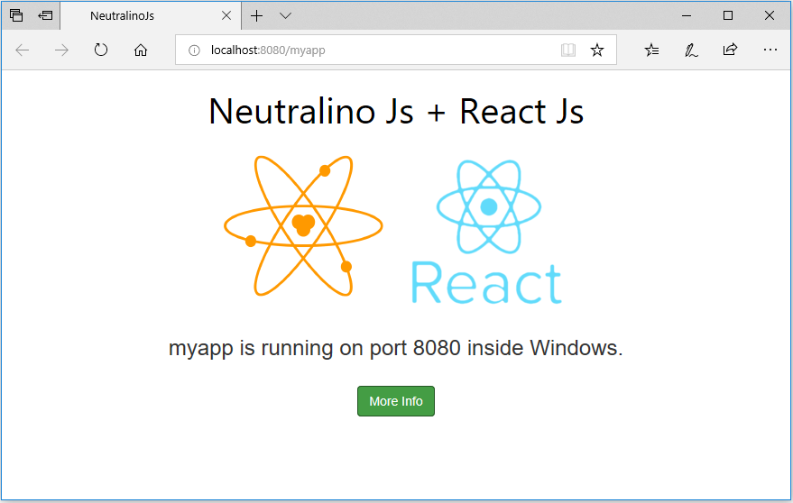

# Neutralino + ReactJs Template
A neutralino app made with ReactJs which could be used as a template!

## Running this application 
1. Clone or Download this Repository
2. Open the `neutralino.exe` file.
3. The app runs in your default browser, the application closes as soon as you close the tab. 

## Screenshot

[View More Samples](https://github.com/neutralinojs/neutralinojs-samples)  

Build your own NeutralinoJs app? [Get Started](https://neutralinojs.github.io/docs/#/gettingstarted/quickstart)
